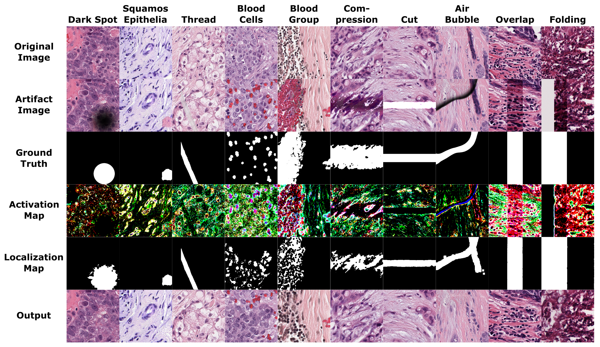

# HARP: Unsupervised Histopathological Artifact Restoration
This is the official code repository for *Unsupervised Histopathological Artifact Restoration Pipeline ([HARP](openreview.net/forum?id=bVunbe4hoV))*. Reliability of histopathological analysis is often challenged by artifacts introduced during sample preparation and imaging, ranging from staining inconsistencies to physical obstructions. While there's been a recent emergence in the domain of artifact restoration in histopathological images, all of them rely on supervised methodologies, requiring considerable manual input or supervision on artifacts for effective WSI restoration. So to address this, we introduce HARP, a novel, fully unsupervised histopathological artifact restoration pipeline, that integrates artifact detection, localization, and restoration into one pipeline.

To install via PyPi please run:
```shell
pip install HARPipe
pip install 'git+https://github.com/facebookresearch/segment-anything.git'
```
        
<div>

</p>
</div>


## Table Of Contents
1. [Installation](#installation)
2. [Model Checkpoints and Dataset](#model-checkpoints-and-dataset)
3. [Usage](#usage)
5. [Results](#results)
6. [Citations](#citation)
7. [Acknowledgement](#acknowledgement)


## Installation
To set up HARP, start by cloning the repository and navigate to the `environment.yaml` file to install the [conda](https://conda.io/) environment named `harp`. Activate the Conda environment.

```shell
git clone https://github.com/MECLabTUDA/HARP.git
cd HARP
conda env create -f environment.yaml
conda activate harp
```


## Model Checkpoints and Dataset
Download the checkpoints of the respective models from the provided sources. Once downloaded, update the paths of the models in the `config/config_restoration_model.json` file to reflect their new locations.

- `Artifact Detection`: [FastFlow model](https://huggingface.co/SsharvienKumar/HARP_Models/resolve/main/anomalib_fastflow.ckpt?download=true)
- `Artifact Segmentation`: [ViT-H SAM model](https://dl.fbaipublicfiles.com/segment_anything/sam_vit_h_4b8939.pth)
- `Artifact Restoration`: [Our restoration model](https://huggingface.co/SsharvienKumar/HARP_Models/resolve/main/restoration_model.pth?download=true)

To train all the above models, we have have extracted patches from the BCSS dataset of size 600x600 with 0.24 mpp, which we downsize to 256x256. This has resulted in 11075 training, 1031 validation and 1000 test patches. For evaluation, we have leveraged [FrOoDo](https://github.com/MECLabTUDA/FrOoDo) to synthetically apply 10 different artifacts on randomly chosen 100 test patches.The dataset have been made available and can be downloaded from the source stated below:

- `Dataset used for training and evaluation`: [Dataset](https://huggingface.co/SsharvienKumar/HARP_Models/resolve/main/dataset.zip?download=true)


## Usage
1. To train the restoration model on your own dataset, use the following training script. Ensure to update the `data_root` path for both the train and validation split of the dataset accordingly. 
```
python train_restoration.py -p train -c config/config_restoration_model.json
```

2. To train the Fastflow model for artifact detection, refer to the [Anomalib](https://github.com/openvinotoolkit/anomalib.git) repo.

3. To run the `HARP` pipeline, use the script below. Update the input and output path in the `config/config_harp.json`. Also make sure to update the model checkpoint paths as shown in [Model Checkpoints](#model-checkpoints-and-dataset). 
```
python harp_pipeline.py -c config/config_harp.json
```

## Usage as PyPI Package
```python
from harpipe import HARP, HARPDataset

harp = HARP("path/to/config_harp.json")
dataset = HARPDataset(harp.config["input_folder_path"], harp.config["image_size"])

for image in dataset:
        restored_image, restored_mask = harp.harp_pipeline(image)
```


## Results
### Qualitative Results
<div>

</p>
</div>


This video shows the steps in the HARP Pipeline including our novel restoration method. 
<video src="https://github.com/MECLabTUDA/HARP/assets/77108842/8eeff43d-7e7a-42d1-8ada-057ef4413dde" width="80" />


### User Study
We conducted a user study with four pathologists on 50 image pairs as a visual turning test to evaluate the produced image quality. One of the images from the pair is a normal image from the training distribution, and the other is an image from the test distribution augmented with an artifact and then restored with HARP. All our participants found it impossible to tell the real difference between images, as our results suggest, at best, there is a weak positive correlation by chance.

| Clinician | DE1 | DE2 | DE3 | DE4 | 
|-----------|------|------|------|-----|
| MCC       | -0.071| -0.159 | 0.239 | 0.296 | 
| FR        | 27/50 | 30/50 | 20/50 | 18/50 | 


### Downstream Performance
We evaluated the segmentation performance of the downstream model using clean images, artifact images, and restored images with `HARP`. The performance of the artifact images significantly decreases compared to the originally clean images. HARP is able to recover the artifact images and effectively reduces the performance drop introduced by the artifacts by 48%, which makes the downstream model more robust and reliable for the daily clinical workflow.

| Performance (DICE %) | Tumor | Stroma | Lymphocyte-rich | Necrosis | Average |
|:--------------:|:-----:|:------:|:---------------:|:--------:|:-------:|
| Clean     |  86.1 |  83.8  |       81.8      |   74.2   |   81.5  |
| Artifacts   |  77.7 |  77.9  |       76.2      |   64.9   |   74.2  |
| HARP (Ours)  |  82.2 |  82.0  |       78.5      |   69.3   |   78.0  |


## Citations
If you are using HARP for your article, please cite the following paper:
```
@inproceedings{fuchs2024harp,
  title={HARP: Unsupervised Histopathology Artifact Restoration},
  author={Fuchs, Moritz and Sivakumar, Ssharvien Kumar R and Sch{\"o}ber, Mirko and Woltering, Niklas and Eich, Marie-Lisa and Schweizer, Leonille and Mukhopadhyay, Anirban},
  booktitle={Medical Imaging with Deep Learning},
  year={2024}
}
```
## Acknowledgement
Thanks for the following projects and theoretical works that we have either used or inspired from:
- The architecture of our conditional model from Janspiry's [Palette](https://github.com/Janspiry/Palette-Image-to-Image-Diffusion-Models) implementation
- [Segment Anything (SAM)](https://github.com/facebookresearch/segment-anything)
- The implementation of [FastFlow](https://arxiv.org/abs/2111.07677) by [Anomalib](https://github.com/openvinotoolkit/anomalib)

